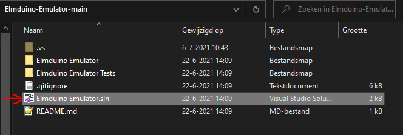
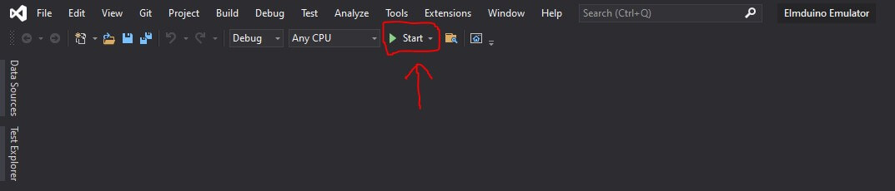
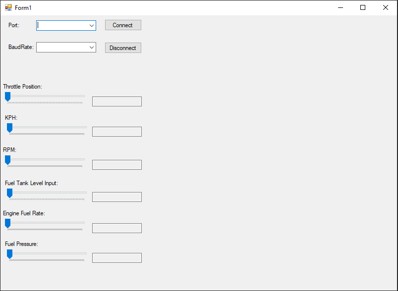

# Elmduino-Emulator

## Introduction
This is something that I made for a project in school, to test our arduino setup that uses the [ELMduino library](https://github.com/PowerBroker2/ELMduino).

## Supported PIDs
1. FUEL_PRESSURE (0x0A)
2. ENGINE_RPM (0x0C)
3. VEHICLE_SPEED (0x0D)
4. THROTTLE_POSITION (0x11)
5. FUEL_TANK_LEVEL_INPUT (0x2F)
6. ENGINE_FUEL_RATE (0x5E)

[List of all PIDs](https://en.wikipedia.org/wiki/OBD-II_PIDs)

## How to use it

If you downloaded/cloned the repository, you need to click the Elmduino Emulator.sln file to open it in Visual Studio.

In Visual Studio you press the start button.

When the programs starts you can select a COM port and the baudrate. You can adjust the values of the supported PIDs by sliding the trackbars to a different value. 

**NOTE: THROTTLE_POSITION, FUEL_TANK_LEVEL_INPUT, FUEL_PRESSURE aren't precise, for example throttle position of 50% will actually be calculated as 49% on the Arduino.**
