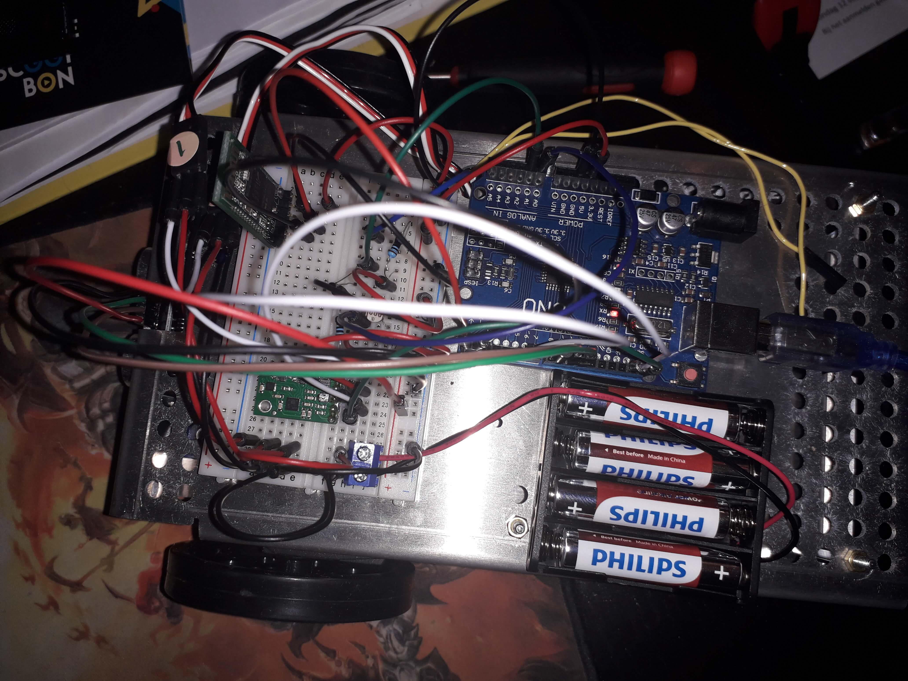

# Motor Controller

## Dutch
Dit is de code die ik gebruikt heb voor mijn eigen project in semester 2 waar ik de Robohub(soort auto) heb laten rondrijden via een [C# applicatie](../Robohub-PC-App).
Ik heb 2 [Parallax Feedback Servo's](https://www.parallax.com/product/parallax-feedback-360-high-speed-servo/) gebruikt en de [ultrasonische sensor](https://www.sparkfun.com/products/15569).
Verder heb ik een [bluetooth module](https://www.tinytronics.nl/shop/nl/communicatie/bluetooth/bluetooth-hc-05-module-rf-transceiver-master-en-slave),
[accelerometer](https://www.pololu.com/product/2738),
[thermistor](https://www.tinytronics.nl/shop/nl/componenten/weerstanden/ntc-mf5a-3-10k)
en [LDR](https://www.tinytronics.nl/shop/nl/componenten/weerstanden/gl5528-ldr-lichtgevoelige-weerstand) gebruikt.
De ultrasonische sensor zorgt ervoor dat je niet tegen een object aanrijdt.
Er wordt ook data van de sensoren verstuurd naar de C# applicatie en het wordt in een csv bestand gestopt.

## English
This is the code that I made for my own project in my second semester for school, where I made the Robohub drive around via a [C# application](../Robohub-PC-App).
I have used 2 [Parallax Feedback Servo's](https://www.parallax.com/product/parallax-feedback-360-high-speed-servo/)
and the [ultrasonic sensor](https://www.sparkfun.com/products/15569).
I also made use of a [bluetooth module](https://www.tinytronics.nl/shop/nl/communicatie/bluetooth/bluetooth-hc-05-module-rf-transceiver-master-en-slave),
[accelerometer](https://www.pololu.com/product/2738),
[thermistor](https://www.tinytronics.nl/shop/nl/componenten/weerstanden/ntc-mf5a-3-10k)
and [LDR](https://www.tinytronics.nl/shop/nl/componenten/weerstanden/gl5528-ldr-lichtgevoelige-weerstand).
The ultrasonic is in use so that you can't drive into the wall.
The data of the sensors is send to the C# application and it is put into a csv file.

## Pictures

